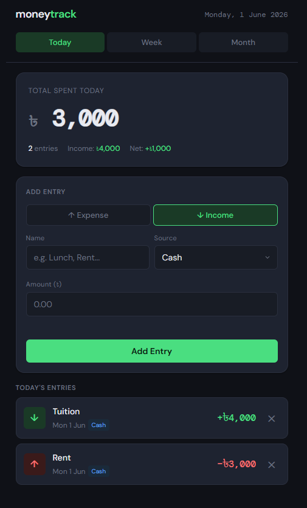

# 💸 MoneyTrack

> A personal daily expense and income tracker —  progressing from a static web app to a full-stack AI-powered application.

**🔗 Live Demo:** [legendary-dango-43cd29.netlify.app](https://legendary-dango-43cd29.netlify.app)

---

## 📱 Screenshots




---

## ✨ Features

- 📅 Auto-selects today's date on open
- ➕ Add expense or income entries instantly
- 💳 Track payment source — Cash, bKash, Nagad, Bank, Card
- 📊 Daily summary — total spent, income, net balance
- 📈 Weekly bar chart with full entry history
- 🗓️ Monthly totals, source breakdown, daily history
- 💾 Data persists across browser sessions
- 📱 Fully responsive — works on mobile and desktop

---

## 🛠️ Tech Stack

### Phase 1 (Current)
| Layer | Technology |
|---|---|
| Frontend | HTML5, CSS3, Vanilla JavaScript |
| Storage | Browser localStorage (JSON) |
| Web Server | Nginx |
| Container | Docker + Docker Compose |
| Deployment | Netlify |
| Version Control | Git + GitHub |

---

## 🏗️ Project Structure

```
moneytrack/
├── frontend/
│   ├── src/
│   │   ├── index.html          # App shell — structure only
│   │   ├── css/
│   │   │   └── main.css        # Design tokens + all components
│   │   └── js/
│   │       ├── utils.js        # Pure helper functions
│   │       ├── storage.js      # All data read/write (Repository Pattern)
│   │       ├── ui.js           # All DOM rendering
│   │       └── app.js          # Main controller + event listeners
│   └── nginx.conf              # Production web server config
├── docs/
│   └── README.md               # Full technical documentation
├── .gitignore
├── docker-compose.yml
└── Dockerfile                  # Multi-stage production build
```

### Architecture — Separation of Concerns

Each JavaScript file has exactly **one job**:

| File | Responsibility |
|---|---|
| `utils.js` | Pure math & formatting — no DOM, no storage |
| `storage.js` | All localStorage read/write — **Repository Pattern** |
| `ui.js` | All DOM rendering — no business logic |
| `app.js` | Controller — coordinates data + UI |

This structure means in **Phase 2**, `storage.js` is replaced with a Firebase version and the rest of the app stays completely unchanged.

---

## 🚀 Run Locally

### Prerequisites
- [Docker Desktop](https://www.docker.com/products/docker-desktop/) installed and running
- [Git](https://git-scm.com/) installed

### Steps

```bash
# 1. Clone the repository
git clone https://github.com/web3Riyad/moneytrack.git
cd moneytrack

# 2. Start with Docker
docker compose up --build

# 3. Open in browser
# http://localhost:3000
```

To stop:
```bash
docker compose down
```

---

## 🗺️ Roadmap

This project is being built in phases to demonstrate growth across the full stack.

| Phase | Description | Status |
|---|---|---|
| **1 — Static** | HTML/CSS/JS + localStorage + Docker + Netlify | ✅ Live |
| **2 — Multi-user** | Firebase Auth + Firestore cloud database | ✅ Live |
| **3 — Full-stack** | React + Supabase (PostgreSQL) + Vercel | 🔜 Next |
| **4 — PWA** | Installable app, offline support, push notifications | 📋 Planned |
| **5 — AI/ML** | Spending predictions, smart categorisation, natural language input | 📋 Planned |

---

## 📐 Code Standards

- **JavaScript** — Strict mode, IIFEs, JSDoc comments, XSS-safe rendering
- **CSS** — Design tokens, BEM naming, mobile-first, reduced-motion support
- **Git** — Conventional Commits (`feat:`, `fix:`, `docs:`, `refactor:`)
- **Docker** — Multi-stage build, health checks, resource limits
- **Security** — Input sanitisation, HTML escaping, Content Security headers via Nginx

---

## 📄 License

MIT — feel free to use this project as a reference or starting point.

---

*Built step by step as a learning and portfolio project. Each phase introduces new technologies and patterns.*
